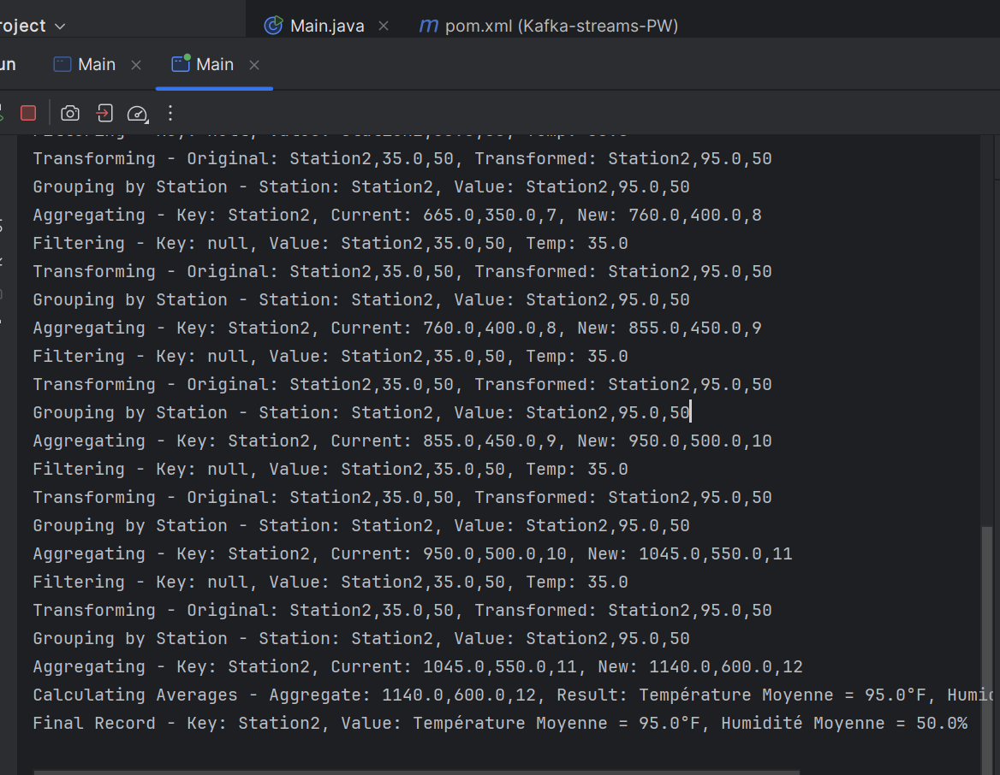

# TP 1: Kafka Streams

## Analyse de Données Météorologiques

### Description
Une entreprise collecte des données météorologiques en temps réel via Kafka. Chaque station météorologique envoie des messages dans un topic Kafka nommé **`input-topic`**.

Les messages suivent le format suivant :
- **station** : Identifiant de la station (par exemple, Station1, Station2, etc.).
- **temperature** : Température mesurée en degrés Celsius (°C), par exemple 25.3.
- **humidity** : Pourcentage d'humidité, par exemple 60.

L'objectif de cet exercice est de développer une application Kafka Streams pour transformer et analyser ces données.

---

### Contraintes
- Utilisez les concepts de **KStream**, **KTable**, et **KGroupedStream**.
- Assurez une sérialisation correcte des données.
- Gérez un arrêt propre de l'application en ajoutant un **hook**.

---
## Configuration des Topics et Clients Kafka

### Création des Topics
Pour créer les topics **`input-topic`** et **`output-topic`**, utilisez les commandes suivantes dans le terminal Kafka :

1. **Créer le topic `input-topic`** :
    ```bash
    kafka-topics.sh --create --bootstrap-server localhost:9092 --replication-factor 1 --partitions 1 --topic input-topic
    ```

2. **Créer le topic `output-topic`** :
    ```bash
    kafka-topics.sh --create --bootstrap-server localhost:9092 --replication-factor 1 --partitions 1 --topic output-topic
    ```

---

### Producer : Publier des messages dans `input-topic`
Pour envoyer des messages au topic **`input-topic`**, utilisez la commande suivante :

```bash
kafka-console-producer.sh --broker-list localhost:9092 --topic input-topic
````
---
### Consumer : Lire les messages de `output-topic`
```bash
kafka-console-consumer.sh --bootstrap-server localhost:9092 --topic output-topic --from-beginning
````

---

### Objectifs
À la fin de cet exercice, votre application Kafka Streams devra :
1. Lire les données météo depuis le topic **`input-topic`**.
2. Filtrer et transformer les relevés météorologiques.
3. Publier les moyennes de température et d'humidité par station dans le topic **`output-topic`**.

---
### Résultat

#### Données dans le topic **`input-topic`** :



#### Données publiées dans le topic **`output-topic`** :

